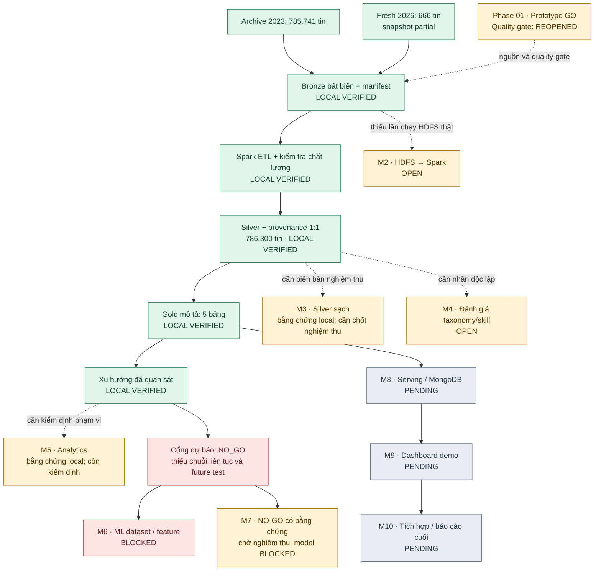

# BigData IT Job Skill Analytics

Hệ thống Big Data phục vụ **phân tích thị trường tuyển dụng CNTT quốc tế** và **dự báo xu hướng nhu cầu kỹ năng theo từng nhóm nghề**, sử dụng dữ liệu tuyển dụng lịch sử kết hợp với dữ liệu tuyển dụng mới.

> **Trạng thái ngày 07/10/2026:** Silver **786.300 tin** và **5 bảng Gold mô tả** đã được kiểm chứng local theo báo cáo chạy ngày 04/10/2026. **M2/HDFS vẫn mở**, cổng dự báo **NO-GO**; serving và dashboard chưa hoàn thành.

## Tiến độ hiện tại — 07/10/2026

[Báo cáo tiến độ và việc cần làm tiếp theo](docs/planning/PROJECT_PROGRESS_2026-10-07.md) · [Bằng chứng Phase 03](docs/reviews/PHASE_03_ANALYTICS_REPORT.md)

Sơ đồ thể hiện bằng chứng hiện có, không phải phần trăm hoàn thành. Các milestone M2–M10 theo [Final Plan](FINAL_PLAN_BigData_IT_Job_Market_Skill_Forecasting.md).



**Chú giải:** 🟩 `LOCAL VERIFIED`: đã kiểm chứng local; 🟨 `OPEN`: còn điều kiện nghiệm thu; 🟥 `BLOCKED`: bị chặn bởi cổng dữ liệu; ⬜ `PENDING`: chưa có đầu ra bàn giao.

**M7:** đã có bằng chứng cho nhánh NO-GO, còn chờ nghiệm thu; huấn luyện và công bố model vẫn bị chặn. Có thể tiếp tục dashboard mô tả từ Gold trong khi hoàn tất HDFS, kiểm định taxonomy và bổ sung dữ liệu.

---

## 1. Tổng quan đề tài

Đề tài tập trung xây dựng pipeline Big Data có khả năng:

- Thu thập dữ liệu tuyển dụng lịch sử và dữ liệu tuyển dụng mới.
- Làm sạch, chuẩn hóa và khử trùng lặp dữ liệu bằng Apache Spark.
- Chuẩn hóa chức danh tuyển dụng về các nhóm nghề CNTT chính.
- Trích xuất và chuẩn hóa kỹ năng từ mô tả công việc.
- Phân tích nhu cầu kỹ năng theo **Occupation + Skill + Time**.
- Phân loại xu hướng kỹ năng thành **Growing**, **Stable** hoặc **Declining**.
- Khi quality gate cho phép, so sánh bốn nhánh A/B/C/D trên cùng future test và baseline `Stable`.
- Xây dựng dashboard trực quan phục vụ phân tích thị trường việc làm và nhu cầu kỹ năng CNTT.

### Phạm vi thị trường

- **Global Market:** phạm vi chính thức của MVP (`market = "GLOBAL"`).
- **Vietnam Market:** hiện đang **FROZEN**, được giữ trong kiến trúc để có thể mở rộng sau khi MVP hoàn thiện.

### Nguyên tắc dự báo

Hệ thống **không dự báo xu hướng kỹ năng chung cho toàn ngành CNTT**.

Xu hướng được phân tích và dự báo theo từng nhóm nghề dựa trên bộ ba:

```text
Occupation + Skill + Time
```

Ví dụ, xu hướng `React` của Frontend Developer và xu hướng `Spark` của Data Engineer được xem là hai chuỗi nhu cầu riêng biệt.

---

## 2. Phạm vi nghề nghiệp

Hệ thống hiện chuẩn hóa dữ liệu về **8 nhóm nghề CNTT**:

1. Data Analyst
2. Data Scientist
3. Data Engineer
4. Machine Learning Engineer
5. Software Engineer
6. Backend Developer
7. Frontend Developer
8. DevOps Engineer

Taxonomy kỹ năng hiện gồm **8 nhóm công nghệ**, hơn **35 kỹ năng chính** cùng các từ khóa đồng nghĩa phục vụ Skill Extraction.

---

## 3. Nguồn dữ liệu đã xác thực

### Historical Data

Nguồn dữ liệu lịch sử đã được chọn có quy mô hơn **780.000 tin tuyển dụng**, có trường thời gian `job_posted_date` đạt yêu cầu để thực hiện phân tích chuỗi thời gian.

### Fresh Data

Hai nguồn API đã được kiểm thử thành công để lấy dữ liệu tuyển dụng mới:

- Arbeitnow API
- Remotive API

Kết quả kiểm định Phase 1 trên **567 bản ghi mẫu**:

```text
Trung bình kỹ năng trích xuất: 5.57 skills / job description
Khoảng thời gian dữ liệu kiểm thử: 50 tháng (2022 → 2026)
Kết quả GO / NO-GO: GO
```

Chi tiết xem tại:

- [Tổng kết Phase 01 & 02](docs/planning/phase_01_02_summary.md)
- [Báo cáo GO / NO-GO](docs/planning/go_no_go_report.md)

---

## 4. Unified Schema

Dữ liệu sau chuẩn hóa sử dụng **18 trường thống nhất**:

```text
job_id
title
normalized_title
company
location
city
country
market
work_mode
description
experience_level
salary_min
salary_max
currency
posted_at
collected_at
source
skills
```

Hệ thống đồng thời sử dụng `job_hash` SHA-256 để hỗ trợ phát hiện tin tuyển dụng trùng lặp hoặc repost.

---

## 5. Kiến trúc hệ thống

```text
          Historical Job Data
                  +
            Fresh Job APIs
                  |
                  v
          RAW / INGESTION
                  |
                  v
            Bronze Layer
       Raw JSON + Metadata
                  |
                  v
           Apache Spark
     -----------------------
     Cleaning
     Text Normalization
     Deduplication SHA-256
     Job Title Mapping
     Skill Extraction
     Unified Schema
     -----------------------
                  |
                  v
            Silver Layer
       Parquet + Snappy
      Partition year/month
                  |
                  v
       Feature Engineering
                  |
          +-------+-------+
          |               |
          v               v
      Analytics       Spark MLlib
          |          Trend Prediction
          +-------+-------+
                  |
                  v
             Gold Layer
                  |
                  v
              MongoDB
                  |
                  v
        Streamlit Dashboard
```

---

## 6. Kết quả đã hoàn thành

### Phase 01 – Data Feasibility & Project Definition ✅

Đã hoàn thành:

- Chốt phạm vi Global-first và đóng băng Vietnam Market.
- Xây dựng 6 câu hỏi nghiên cứu RQ1 – RQ6.
- Xác định 8 nhóm nghề CNTT.
- Xây dựng Skill Taxonomy và Job Title Mapping.
- Khảo sát và lựa chọn Historical Dataset.
- Kiểm thử Arbeitnow API và Remotive API.
- Thiết kế Unified Schema 18 trường.
- Thiết kế quy tắc Deduplication bằng SHA-256.
- Kiểm thử khả thi trên dữ liệu mẫu.
- Hoàn thành Milestone 1 với quyết định **GO**.

### Phase 02 – Data Ingestion & Big Data Storage (local đã kiểm tra; M2/HDFS đang mở)

Môi trường xử lý dữ liệu đã được thiết lập với:

```text
Python 3.11.9
PySpark 4.2.0
OpenJDK 17.0.10
Hadoop Winutils (không phải dịch vụ HDFS)
```

Lần chạy local ngày 04/10/2026 trên **50.000 dòng đầu của CSV lịch sử** và **snapshot API 666 dòng có phạm vi giới hạn** (`arbeitnow`: 650 dòng/2 trang, `remotive`: 16 dòng/1 trang):

```text
Historical Data : 50,000 records (scoped)
Fresh Data 2026 :    666 records (partial/scoped)
--------------------------------
Bronze Input    : 50,666 records
ID duplicates  :      7 records
--------------------------------
Silver Output   : 50,659 records
Provenance      : 50,659 records
```

Silver Layer hiện được lưu dưới dạng:

```text
Parquet
+ Snappy Compression
+ Partition theo year / month
```

ETL đã kiểm tra số dòng, `job_id` duy nhất và provenance 1:1 trên output local mới trong `tmp/phase02_acceptance/`. Manifest của Bronze và ETL ghi checksum, phạm vi nguồn, phiên bản môi trường và số dòng. Kết quả cũ **50.087** dòng Silver không còn là số liệu nghiệm thu. M2 chưa hoàn tất vì chưa có bằng chứng HDFS → Spark; dữ liệu này chưa đủ cơ sở để mở dự báo.

Chạy kiểm thử Phase 02: `python -m pytest -q`. Trên Windows của phiên chạy này, Spark cần `TEMP` và `TMP` trỏ tới một thư mục ngắn có thể ghi (ví dụ `C:\jtmp`) để Java khởi tạo được SparkContext. Luồng HDFS thật dùng `python -m src.processing.hdfs_smoke --bronze-run <run-dir> --hdfs-root hdfs://<host>:<port>/<path>`; chỉ khi có evidence thành công mới nghiệm thu M2.

---

## 7. Cấu trúc codebase hiện tại

```text
BigData-IT-Job-Skill-Analytics/
│
├── configs/
│   ├── job_title_mapping_v0.json
│   ├── skills_v0.json
│   └── markets.json
│
├── data/
│   ├── raw/
│   │   └── data_jobs.csv
│   │
│   ├── bronze/
│   │   └── global/
│   │       ├── historical/
│   │       └── fresh/
│   │
│   ├── silver/
│   │   └── global/
│   │
│   └── sample/
│
├── docs/
│   ├── planning/
│   ├── data/
│   └── skills/
│
├── src/
│   ├── ingestion/
│   │   ├── historical_ingestion.py
│   │   └── fresh_ingestion.py
│   │
│   └── processing/
│       └── spark_etl.py
│
├── tests/
│   └── test_phase01_feasibility.py
│
├── FINAL_PLAN_BigData_IT_Job_Market_Skill_Forecasting.md
└── README.md
```

> Các dataset dung lượng lớn như file historical gốc và output Bronze/Silver có thể được giữ ngoài Git hoặc loại khỏi version control. Repository chủ yếu lưu source code, cấu hình, tài liệu và các file mẫu cần thiết để tái tạo pipeline.

---

## 8. Công nghệ sử dụng

### Đã sử dụng

- Python
- PySpark
- Apache Spark
- OpenJDK 17
- Hadoop / Winutils
- Parquet
- Snappy Compression
- Git / GitHub

### Các thành phần dự kiến cho các giai đoạn tiếp theo

- Spark MLlib
- MongoDB
- Streamlit
- Plotly

Có thể bổ sung Kafka hoặc Docker nếu phù hợp với tiến độ và phạm vi MVP.

---

## 9. Trạng thái dự án

| Giai đoạn | Nội dung | Trạng thái |
|---|---|---|
| Phase 01 | Data Feasibility & Project Definition | 🔄 GO prototype; quality gate dự báo còn mở |
| Phase 02 | Data Ingestion & Big Data Storage | 🔄 Local đã kiểm tra; M2/HDFS đang mở |
| Phase 03 | Gold mô tả / kiểm toán cổng dự báo | ✅ Local đã chạy và kiểm thử; forecast vẫn NO-GO |
| Phase 04 | Skill Demand Analytics | 🔄 Bảng mô tả đã có; đánh giá taxonomy/M4 còn mở |
| Phase 05 | Feature Engineering & Trend Modeling | ⛔ Chặn bởi cổng dữ liệu NO-GO |
| Phase 06 | Model Evaluation / Hybrid Experiment | ⛔ Chưa chạy vì predictive gate NO-GO |
| Phase 07 | MongoDB & Dashboard | ⏳ Chưa thực hiện |
| Phase 08 | Integration / Testing / Final Report | ⏳ Chưa thực hiện |

### Hiện trạng hệ thống

```text
Raw Data
   ↓
Bronze Layer       ✅ Run bất biến + manifest
   ↓
Spark ETL          ✅ Local fixture và scoped input
   ↓
Silver Layer       ✅ Local; HDFS chưa nghiệm thu
   ↓
Skill Analytics    ✅ Mô tả local theo source/tháng
   ↓
Gold Layer         ✅ Bảng observed, không có prediction mới
   ↓
Predictive Gate    ⛔ NO-GO → chưa train / dự báo
   ↓
Dashboard          ⏳
```

**Silver và Gold mô tả local đã được kiểm tra trên các run có manifest; M2/HDFS vẫn mở và dự báo tiếp tục NO-GO.** Không nối archive 2023 với snapshot 2026 thành chuỗi liên tục.

---

## 10. Tài liệu dự án

- **[Tiến độ dự án ngày 07/10/2026 và việc cần làm](docs/planning/PROJECT_PROGRESS_2026-10-07.md)**
- **[Kế hoạch dự án chính](FINAL_PLAN_BigData_IT_Job_Market_Skill_Forecasting.md)**
- **[Tổng kết Phase 01 & 02](docs/planning/phase_01_02_summary.md)**
- [Runbook Phase 02](docs/planning/phase02_runbook.md)
- [Kế hoạch Phase 03 có cổng dữ liệu](docs/planning/PHASE_03_Feature_Engineering_Spark_MLlib.md)
- [Báo cáo Phase 03: thống kê và kiểm thử](docs/reviews/PHASE_03_ANALYTICS_REPORT.md)
- [Project Scope](docs/planning/project_scope.md)
- [Research Questions](docs/planning/research_questions.md)
- [GO / NO-GO Report](docs/planning/go_no_go_report.md)
- [Unified Schema](docs/data/unified_schema.md)
- [Data Dictionary](docs/data/data_dictionary.md)
- [Schema Mapping](docs/data/schema_mapping.md)
- [Deduplication Rules](docs/data/deduplication_rules.md)
- [Skill Scope](docs/skills/skill_scope.md)

---

## 11. Bước tiếp theo

1. Hoàn tất bằng chứng HDFS → Spark để xét nghiệm thu M2.
2. Xác minh nguồn/license và đánh giá taxonomy trên mẫu JD được gán nhãn độc lập.
3. Kiểm định 5 bảng Gold; xây serving và dashboard mô tả với bộ lọc nguồn, nghề, tháng và giới hạn dữ liệu.
4. Bổ sung dữ liệu dài hạn và chốt hồ sơ M7 theo nhánh NO-GO; chỉ mở feature/model khi cổng dự báo được xét lại thành GO.

Xem thứ tự ưu tiên, đầu ra và điều kiện hoàn thành trong [Project Progress](docs/planning/PROJECT_PROGRESS_2026-10-07.md#tiếp-theo-cần-làm-gì).

---

## Kế hoạch dự án

Kế hoạch chuẩn hiện tại, gồm câu hỏi nghiên cứu, kiến trúc hệ thống, chiến lược dữ liệu, lộ trình, thí nghiệm Machine Learning, phạm vi dashboard, rủi ro và tiêu chí GO / NO-GO:

**[Xem Final Plan →](FINAL_PLAN_BigData_IT_Job_Market_Skill_Forecasting.md)**

`docs/PROJECT_PLAN.md` là tài liệu lập kế hoạch ban đầu được giữ lại để tham khảo lịch sử; nội dung này đã được thay thế bởi Final Plan.

## Trạng thái hiện tại

Phase 01 đã được review lại dựa trên archive trong repository: 785.741 dòng thuộc năm 2023, có source tags nhưng không có job description. Sample historical được lấy trực tiếp từ archive; fixture synthetic đã tách riêng. Quyết định hiện tại là GO cho prototype, conditional GO cho descriptive analytics giới hạn và NO-GO cho forecasting đến khi có dữ liệu nhiều năm, provenance/license và đánh giá taxonomy độc lập. Xem [báo cáo GO/NO-GO](docs/planning/go_no_go_report.md), [audit dữ liệu](docs/data/phase01_data_audit.json) và [review Phase 01](docs/reviews/PHASE_01_SYSTEM_REVIEW.md).
