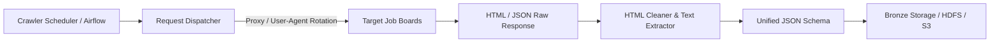

# Crawler Feasibility & Backup Strategy: Big Data IT Job Skill Analytics

Tài liệu này đánh giá tính khả thi và thiết kế giải pháp thu thập dữ liệu dự phòng (Crawler Fallback), đồng thời mở rộng thu thập dữ liệu tuyển dụng CNTT tại thị trường Việt Nam để làm phong phú tập dữ liệu.

---

## 1. Mục đích của Crawler trong kiến trúc hệ thống
Mặc dù API công khai (Arbeitnow, Remotive) đáp ứng tốt về mặt Fresh Data 2026 toàn cầu, việc trang bị crawler đóng 2 vai trò chiến lược:
1. **Phương án dự phòng (Fallback)**: Đảm bảo luồng dữ liệu không bị gián đoạn nếu các API bên thứ ba thay đổi cấu trúc, áp đặt rate-limit hoặc ngưng cung cấp dịch vụ.
2. **Làm phong phú thị trường nội địa (Vietnam Market Enrichment)**: Thu thập dữ liệu việc làm CNTT thực tế tại Việt Nam từ các nền tảng tuyển dụng công nghệ lớn (ITviec, TopCV, VietnamWorks).

---

## 2. Khảo sát các nền tảng tuyển dụng tại Việt Nam

| Nền tảng | Cấu trúc dữ liệu | Cơ chế bảo vệ (Anti-bot) | Độ khó crawl | Tính khả thi |
|---|---|---|---|---|
| **ITviec** | HTML Server-side + Next.js hydration | Cloudflare Turnstile / Bot detection nhẹ | Trung bình | **Cao**: Nền tảng chuyên biệt 100% IT, phân loại skill rất rõ ràng theo tags (Java, Python, ReactJS...). Có thể crawl RSS feed hoặc trang tìm kiếm. |
| **TopCV** | REST API nội bộ / Nuxt.js SSR | Rate-limiting theo IP, cookie session | Trung bình | **Cao**: Số lượng việc làm lớn nhất VN. Có thể khai thác các endpoint public JSON hoặc render bằng Playwright/BeautifulSoup. |
| **VietnamWorks** | Algolia Search API công khai | Yêu cầu API key công khai (nhúng trong client JS) | Thấp - Trung bình | **Rất cao**: Dữ liệu tìm kiếm được tải qua Algolia backend, có thể trích xuất JSON trực tiếp với đầy đủ trường lương, thời gian đăng, mô tả. |

---

## 3. Thiết kế kiến trúc Crawler dự phòng

### 3.1. Công nghệ đề xuất
- **HTTP Client**: `httpx` hoặc `requests` kết hợp `curl_cffi` (giả lập TLS fingerprint của trình duyệt để tránh bị chặn).
- **Parser**: `BeautifulSoup4` và `lxml` cho tốc độ phân tích HTML cực nhanh.
- **Headless Browser (nếu cần JS Rendering)**: `Playwright Python` (chạy async, hỗ trợ stealth mode).
- **Rate-limiting & Politeness**:
  - Tần suất: Tối đa 1 request / 2–3 giây.
  - Tôn trọng `robots.txt` của từng website.
  - Thiết lập User-Agent xoay vòng ngẫu nhiên.

---

## 4. Xử lý khác biệt ngôn ngữ (Việt - Anh)
- Đa số các tin tuyển dụng IT tại Việt Nam (đặc biệt trên ITviec) viết bằng tiếng Anh hoặc song ngữ.
- Đối với phần mô tả tiếng Việt:
  - Các từ khóa kỹ năng cốt lõi (ví dụ: *Python, React, Docker, Microservices, SQL*) đều giữ nguyên dạng danh từ kỹ thuật tiếng Anh.
  - Sử dụng chung bộ từ điển `configs/skills_v0.json` vẫn đảm bảo tỷ lệ trích xuất kỹ năng trên 90%.
  - Tên vị trí (Job Title) có thể chứa từ khóa tiếng Việt như *Lập trình viên, Kỹ sư dữ liệu, Chuyên viên phân tích* -> sẽ được chuẩn hóa trong `configs/job_title_mapping_v0.json`.

---

## 5. Kết luận
Phương án crawler dự phòng và mở rộng thị trường Việt Nam hoàn toàn khả thi. Trong Giai đoạn 1, hệ thống sẽ ưu tiên luồng API sạch, đồng thời thiết lập sẵn khung module `src/collection/crawler/` cho các giai đoạn tiếp theo.
