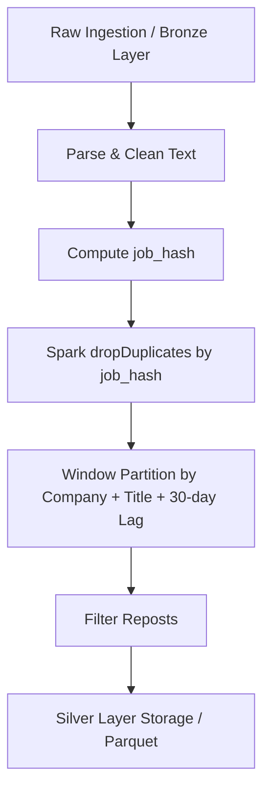

# Deduplication Strategy & Rules: Big Data IT Job Skill Analytics

Tài liệu này quy định chiến lược, quy tắc nhận diện và xử lý dữ liệu trùng lặp (Deduplication Rules) trước khi nạp vào Silver Layer và huấn luyện mô hình Machine Learning.

---

## 1. Các dạng trùng lặp dữ liệu tuyển dụng

Trong thực tế, tin tuyển dụng thường bị trùng lặp dưới 3 hình thức chính:

1. **Trùng lặp tuyệt đối (Exact Duplicates)**:
   - Cùng một tin tuyển dụng được hệ thống cào/gọi API nhiều lần trong các chu kỳ ETL khác nhau.
   - Giống nhau 100% về `title`, `company`, `location`, `posted_at`, `description`.

2. **Trùng lặp đa nền tảng (Cross-platform Duplicates)**:
   - Một công ty đăng cùng một vị trí tuyển dụng trên nhiều trang khác nhau (ví dụ: đăng đồng thời trên LinkedIn, Arbeitnow, Remotive).
   - `title`, `company` giống nhau; `description` tương tự nhưng `job_id` và định dạng HTML khác nhau.

3. **Tin đăng lại / Gia hạn (Re-posted Jobs)**:
   - Nhà tuyển dụng làm mới tin (refresh/re-post) sau 14 hoặc 30 ngày để tăng tương tác mà không thay đổi bản chất công việc.

---

## 2. Thiết kế định danh băm `job_hash`

Để nhận diện trùng lặp nhanh chóng ở quy mô Big Data (trên Apache Spark), hệ thống áp dụng cơ chế sinh mã băm chuẩn `job_hash` (SHA-256):

```python
import hashlib
import re

def compute_job_hash(company: str, title: str, location: str, posted_date: str) -> str:
    # 1. Chuẩn hóa chuỗi (Lowercase, xóa ký tự đặc biệt, trim khoảng trắng)
    norm_company = re.sub(r'[^a-z0-9]', '', (company or "").lower())
    norm_title = re.sub(r'[^a-z0-9]', '', (title or "").lower())
    norm_loc = re.sub(r'[^a-z0-9]', '', (location or "").lower())
    # Chỉ lấy phần ngày YYYY-MM-DD (bỏ qua giờ để bắt tin re-post cùng ngày)
    norm_date = (posted_date or "")[:10]
    
    # 2. Tạo chuỗi khóa tổng hợp
    composite_key = f"{norm_company}|{norm_title}|{norm_loc}|{norm_date}"
    
    # 3. Tính mã SHA-256 (lấy 16 hoặc 32 ký tự hex)
    return hashlib.sha256(composite_key.encode('utf-8')).hexdigest()
```

---

## 3. Quy tắc khử trùng lặp (Deduplication Rules)

### Quy tắc 1: Khử trùng lặp tuyệt đối qua `job_id` và `job_hash`
- Nếu hai bản ghi có cùng `job_id` hoặc cùng `job_hash`:
  - **Hành động**: Chỉ giữ lại **01 bản ghi duy nhất** có thời điểm thu thập gần nhất (`collected_at` lớn nhất).

### Quy tắc 2: Khử trùng lặp đa nền tảng (Cross-platform Fuzzy Matching)
- **Điều kiện**:
  - `norm_company` giống nhau 100%.
  - `norm_title` có độ tương đồng Jaccard $\ge 0.85$.
  - Khoảng cách thời điểm đăng $|posted\_at_1 - posted\_at_2| \le 7 \text{ ngày}$.
- **Hành động**:
  - Hợp nhất thành 1 bản ghi.
  - Ghi nhận `source` dạng liên kết (ví dụ: `"arbeitnow+remotive"`).
  - Ưu tiên bản ghi có `description` dài hơn và trường `salary` không null.

### Quy tắc 3: Xử lý tin đăng lại (Re-posted Jobs trong vòng 30 ngày)
- **Điều kiện**:
  - Cùng `company` và `normalized_title`.
  - $|posted\_at_{new} - posted\_at_{old}| \le 30 \text{ ngày}$.
  - Độ tương đồng cosine của TF-IDF vector giữa 2 JD $\ge 0.90$.
- **Hành động**:
  - Đánh dấu bản ghi mới là `is_repost = true`.
  - Khi tính toán **nhu cầu kỹ năng thị trường (RQ1, RQ2, RQ3)**: Loại bỏ các bản ghi repost để tránh thổi phồng (artificially inflating) nhu cầu thực tế của một vị trí.

---

## 4. Vị trí thực thi trong Pipeline Big Data



- Khử trùng lặp được thực thi hoàn toàn trong **Apache Spark ETL Pipeline** (giữa Bronze và Silver Layer).
- Sử dụng hàm tích hợp sẵn của PySpark: `df.dropDuplicates(["job_hash"])` kết hợp Spark Window Functions để tối ưu hóa hiệu năng tính toán phân tán.
