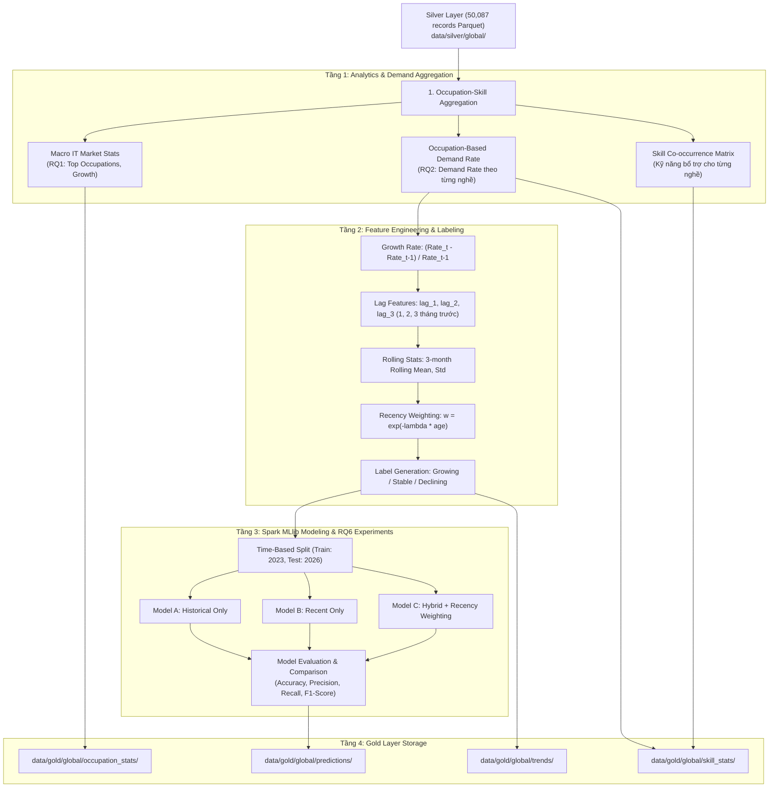

# Kế hoạch Triển khai Giai đoạn 3: Feature Engineering & Spark MLlib Analytics

## 1. Mục tiêu Giai đoạn 3

Giai đoạn 3 tập trung vào việc khai thác dữ liệu sạch từ **Silver Layer (50.087 bản ghi Parquet)** để thực hiện phân tích chuyên sâu và huấn luyện mô hình Machine Learning dự báo xu hướng kỹ năng theo đặc tả chính thức của [FINAL_PLAN_BigData_IT_Job_Market_Skill_Forecasting.md](file:///d:/Study/2026/Nam04_HK1/bigData_T.Ha/BigData_Job_Analy/FINAL_PLAN_BigData_IT_Job_Market_Skill_Forecasting.md).

---

## 2. Các điểm cần xác nhận (User Review Required)

> [!IMPORTANT]
> 1. **Ngưỡng phân loại xu hướng kỹ năng (Thresholds for Growing / Stable / Declining)**:
>    - Khi tính toán tốc độ tăng trưởng nhu cầu kỹ năng trong tương lai ($\Delta DemandRate$), chúng ta phân loại như sau:
>      - **Growing**: Tăng trưởng $> +5\%$
>      - **Stable**: Biến động trong khoảng $[-5\%, +5\%]$
>      - **Declining**: Suy giảm $< -5\%$
> 2. **Thuật toán Machine Learning chính trong Spark MLlib**:
>    - Để dự báo nhãn (Growing, Stable, Declining) dựa trên các đặc trưng trễ và occupation, chúng tôi đề xuất sử dụng **Random Forest Classifier** và **Logistic Regression (Multinomial)** của Spark MLlib.
>    - Cấu trúc: **1 Global Model** có `occupation` làm categorical feature (qua `StringIndexer` + `OneHotEncoder`) theo đúng khuyến nghị trong Final Plan (Mục 18).

---

## 3. Nội dung thực hiện chi tiết (Proposed Changes)

### 3.1. Phân tích Nhu cầu Kỹ năng theo Nghề (RQ1, RQ2, RQ3)
- Tạo module `src/analytics/demand_analytics.py`:
  - **Layer 1 - Macro Market Analytics (RQ1)**:
    - Thống kê tổng số tin tuyển dụng, phân bố theo quốc gia (`country`), hình thức làm việc (`work_mode`), cấp bậc kinh nghiệm (`experience_level`).
    - Tính toán tỷ trọng tuyển dụng của từng nghề: $P(O_i, T)$.
  - **Layer 2 - Occupation-Based Demand Analytics (RQ2, RQ3)**:
    - Tính **Demand Rate** cho từng kỹ năng trong từng occupation theo từng tháng:
      $$\text{Demand Rate}(S_j \mid O_i, t) = \frac{\text{Số jobs thuộc } O_i \text{ có } S_j \text{ trong tháng } t}{\text{Tổng số jobs thuộc } O_i \text{ trong tháng } t}$$
    - Tính toán **Ma trận đồng xuất hiện kỹ năng (Skill Co-occurrence)** cho mỗi occupation (ví dụ: xác suất một Frontend Developer cần cả React và TypeScript).
  - Xuất kết quả vào `data/gold/global/occupation_stats/` và `data/gold/global/skill_stats/`.

### 3.2. Xây dựng Bộ Đặc trưng & Gán nhãn (Feature Engineering)
- Tạo module `src/ml/feature_engineering.py`:
  - Đọc chuỗi thời gian `(occupation, skill, year, month, demand_rate)`.
  - Sinh các đặc trưng trễ (Lag Features) bằng Spark Window functions:
    - `lag_1`: Demand rate tháng $t-1$.
    - `lag_2`: Demand rate tháng $t-2$.
    - `lag_3`: Demand rate tháng $t-3$.
    - `growth_rate_1m`: $\frac{\text{lag\_1} - \text{lag\_2}}{\text{lag\_2} + \epsilon}$.
    - `rolling_mean_3m`: Trung bình trượt 3 tháng gần nhất.
    - `rolling_std_3m`: Độ lệch chuẩn trượt 3 tháng gần nhất.
  - **Tính trọng số thời gian (Recency Weighting)**:
    $$w(t) = \exp(-\lambda \cdot (t_{max} - t))$$
    Trong đó các mốc thời gian gần (2025–2026) được gán trọng số lớn hơn để phản ánh sự thay đổi nhanh chóng của công nghệ.
  - **Gán nhãn mục tiêu (Target Label Generation)**:
    - So sánh nhu cầu tại thời điểm dự báo với hiện tại để gán nhãn: `0: Declining`, `1: Stable`, `2: Growing`.
  - Xuất dataset đã tạo đặc trưng vào `data/gold/global/trends/feature_matrix.parquet`.

### 3.3. Huấn luyện Mô hình Spark MLlib & Thực nghiệm RQ6
- Tạo module `src/ml/train_models.py`:
  - Xây dựng Spark ML Pipeline:
    - `StringIndexer` & `OneHotEncoder` cho `occupation`.
    - `VectorAssembler` gộp toàn bộ feature trễ, rolling stats, và occupation vector thành cột `features`.
    - `StandardScaler` chuẩn hóa vector đặc trưng.
  - **Thực hiện 3 thí nghiệm so sánh (RQ6)**:
    1. **Model A (Historical Only)**: Huấn luyện trên dữ liệu năm 2023.
    2. **Model B (Recent Only)**: Huấn luyện trên dữ liệu gần đây năm 2026.
    3. **Model C (Hybrid + Recency Weighting)**: Huấn luyện trên toàn bộ dữ liệu lịch sử và dữ liệu mới với cột `weightCol = "recency_weight"`.
  - **Đánh giá mô hình**:
    - Sử dụng `MulticlassClassificationEvaluator` của Spark MLlib đo lường:
      - Weighted Precision
      - Weighted Recall
      - Weighted F1-Score
      - Accuracy
    - Đánh giá trên tập kiểm thử thời gian (Time-based Test Set 2026).
  - Xuất bảng so sánh mô hình và lưu mô hình tốt nhất vào `data/gold/global/predictions/models/`.

### 3.4. Xuất Dự báo Tương lai cho Từng Nghề (RQ4)
- Tạo module `src/ml/predict_trends.py`:
  - Áp dụng mô hình Hybrid tốt nhất để dự báo xu hướng tiếp theo cho từng cặp `(occupation, skill)`.
  - Xuất bảng kết quả dự báo ra JSON / Parquet tại `data/gold/global/predictions/skill_forecast_by_occupation.json` để phục vụ trực tiếp cho Dashboard và Recommendation Engine ở Giai đoạn 4.

---

## 4. Kế hoạch Kiểm tra & Xác minh (Verification Plan)

### Kiểm tra tự động (Automated Verification)
1. **Kiểm tra Demand Analytics**:
   - Chạy `python src/analytics/demand_analytics.py`.
   - Xác nhận bảng thống kê `occupation_skill_monthly_stats` có đủ 8 occupation, demand rate nằm trong đoạn $[0.0, 1.0]$.
2. **Kiểm tra Feature Engineering**:
   - Chạy `python src/ml/feature_engineering.py`.
   - Kiểm tra `feature_matrix.parquet` có đầy đủ các cột: `lag_1`, `lag_2`, `lag_3`, `rolling_mean_3m`, `recency_weight`, `label`.
   - Xác nhận không có giá trị NaN / vô cùng.
3. **Kiểm tra Huấn luyện Mô hình**:
   - Chạy `python src/ml/train_models.py`.
   - Xác nhận cả 3 Model A, Model B, Model C huấn luyện thành công và xuất ra bảng so sánh Accuracy, F1-Score.
4. **Kiểm tra Dự báo Tương lai**:
   - Chạy `python src/ml/predict_trends.py`.
   - Kiểm tra file `skill_forecast_by_occupation.json` có dự báo Growing/Stable/Declining cho từng nghề (ví dụ: Frontend -> TypeScript, React; Backend -> Java, SQL, Kafka).

### Kiểm tra thủ công (Manual Verification)
- Người dùng duyệt bảng so sánh độ chính xác của 3 mô hình (Model A vs B vs C) và kết quả phân loại xu hướng kỹ năng trước khi chuyển sang xây dựng MongoDB & Streamlit Dashboard (Giai đoạn 4).
