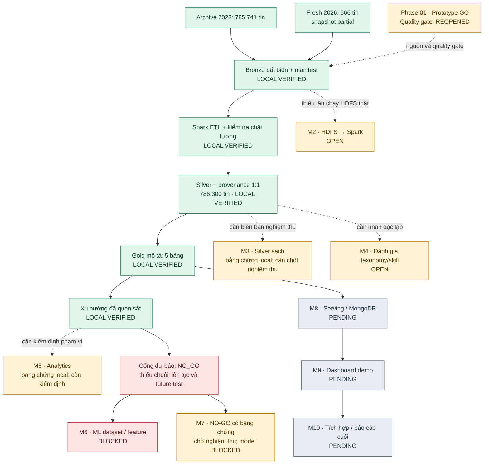

# Tiến độ dự án và việc cần làm tiếp theo — 07/10/2026

**Phạm vi ảnh chụp:** trạng thái repository tại ngày 07/10/2026, dựa trên bằng chứng chạy và kiểm thử mới nhất ngày 04/10/2026. Đây là tiến độ theo **bằng chứng**, không phải phần trăm hoàn thành. “Đã kiểm chứng local” không đồng nghĩa milestone đã được nghiệm thu trên HDFS hay dữ liệu đã đủ để dự báo.

## Sơ đồ tiến độ

**Chú giải:** `LOCAL VERIFIED` = đã có run/kiểm thử trên máy local; `OPEN` = còn điều kiện nghiệm thu; `BLOCKED` = chưa được phép triển khai theo cổng dữ liệu; `PENDING` = chưa có chức năng/bằng chứng bàn giao tương ứng. Sơ đồ dùng milestone **M2–M10 của [Final Plan](../../FINAL_PLAN_BigData_IT_Job_Market_Skill_Forecasting.md)**. Tên Phase 03 trong [README](../../README.md) là nhịp triển khai Gold hiện tại, không phải tuyên bố rằng toàn bộ M3/M4/M5/M8 trong Final Plan đã đóng.

**Riêng M7:** Final Plan cho phép đầu ra “Forecast Model Ready **hoặc NO-GO có bằng chứng**”. Audit Phase 03 cung cấp bằng chứng cho nhánh NO-GO, nhưng chưa có biên bản nghiệm thu M7; phần huấn luyện và công bố model vẫn bị chặn.

## Bằng chứng hiện có

| Hạng mục | Kết quả đã xác minh | Giới hạn còn lại |
|---|---|---|
| Nguồn historical | 785.741 dòng trong archive local, chỉ năm 2023 | Thiếu JD gốc, license/điều khoản chưa được xác minh đầy đủ; không đại diện toàn thị trường. |
| Nguồn fresh | 666 tin trong Bronze run, trạng thái `partial` | Snapshot API có phạm vi giới hạn, chưa chứng minh thu thập định kỳ. |
| ETL local | 786.407 đầu vào → 786.300 Silver và 786.300 provenance; 106 trùng identity, 1 quarantine | Chưa có lần chạy HDFS → Spark được nghiệm thu. |
| Gold mô tả | 5 bảng; `skill_stats` và `skill_trends` mỗi bảng 4.538 dòng | Chỉ mô tả theo nguồn, nghề, tháng và nguồn chứng cứ kỹ năng; không có prediction. |
| Kiểm thử gần nhất | `15 passed, 1 skipped` ngày 04/10/2026 | Bài HDFS live bị skip vì chưa có dịch vụ/URI HDFS hoạt động. Không chạy lại pytest chỉ để lập ảnh chụp này. |
| Forecast | `NO_GO`; không có model metric hoặc nhãn dự báo | Archive 2023 và snapshot 2026 có **32 tháng không quan sát** từ 2023-01 đến 2026-10, gồm toàn bộ 2024–2025. |
| Dashboard | Có `dashboard/app.py` dạng scaffold | Chưa có các trang phân tích/serving được kiểm chứng. |

Số liệu và checksum chi tiết: [báo cáo Phase 03](../reviews/PHASE_03_ANALYTICS_REPORT.md), [audit JSON](../data/phase03_analytics_audit.json), [review Phase 02](../reviews/PHASE_02_SYSTEM_REVIEW.md) và [GO/NO-GO hiện hành](go_no_go_report.md).

## Tiếp theo cần làm gì

Thứ tự dưới đây ưu tiên **đóng cổng còn mở và tạo bản demo mô tả có thể bàn giao**. Việc thu thập dữ liệu dài hạn có thể chạy song song với HDFS, taxonomy và dashboard; không cần chờ forecast để làm dashboard mô tả.

| Ưu tiên | Việc cụ thể | Đầu ra và điều kiện hoàn thành |
|---|---|---|
| 0 · Ngay | Review và lưu các thay đổi Phase 03 đang **chưa commit**; giữ audit/report nhỏ trong Git, giữ Parquet và run local ngoài Git. | `git status`/diff được kiểm tra; tài liệu, mã, test và audit cùng một phiên bản. Lưu đường dẫn/run ID/checksum để nhóm có thể tái lập. |
| 1 · M2 | Chuẩn bị một HDFS thật theo yêu cầu môn học; chạy `src.processing.hdfs_smoke` với Bronze run và URI `hdfs://` hợp lệ, cho Spark đọc/ghi. | Log/manifest có URI, run ID, phiên bản môi trường, số dòng trước/sau, checksum và kết quả đọc lại; test HDFS live chạy thành công. Nếu tiêu chí HDFS được thay đổi, ghi quyết định phạm vi trong Final Plan trước khi đóng M2. |
| 2 · Phase 01 | Lập hồ sơ nguồn cho archive và API: URL, phiên bản, ngày tải, checksum, license/terms, giới hạn phân trang và phạm vi nghề/tháng. | Cập nhật đánh giá nguồn và GO/NO-GO bằng bằng chứng; loại các mô tả cũ về JD hoặc độ dài chuỗi không có thật. |
| 3 · M4 | Gán nhãn **độc lập** cho mẫu JD thật theo nguồn và nghề; kiểm tra title normalization, skill extraction/alias và `Other IT` cao ở fresh. | Bộ nhãn/phiên bản taxonomy, precision/recall/F1 và phân tích lỗi theo nguồn/nghề; báo coverage riêng, không gọi coverage là accuracy. |
| 4 · M5 | Rà lại 5 bảng Gold và contract số liệu dashboard: mọi tỷ lệ kèm `n`, nguồn, tháng, `skills_origin`, taxonomy version và chính sách dedup; giới hạn `country`/`experience` được hiển thị rõ. | Truy vấn Gold tái lập theo manifest/checksum; biểu đồ xu hướng chỉ dùng tháng có quan sát, không nối các nguồn khác chế độ đo. |
| 5 · M8–M9 | Xây serving và dashboard mô tả từ Gold Parquet; thêm MongoDB cho các bảng cần truy vấn nếu phạm vi môn học yêu cầu. | Demo Market/Occupation/Skill/Trend có filter nguồn, nghề, tháng, mẫu số và giới hạn dữ liệu; khu vực forecast hiển thị `Insufficient evidence`. Có test đường đọc Gold và kiểm tra hiển thị số liệu. |
| 6 · Dữ liệu dài hạn | Tìm dữ liệu thật cho các tháng/năm thiếu, đồng thời thu thập fresh định kỳ với provenance và phạm vi nguồn nhất quán. | Audit source × occupation × month sau dedup; phân biệt tháng không quan sát với tỷ lệ bằng 0; đánh giá so sánh nguồn và nhãn kỹ năng đủ chắc. Không tự lấp khoảng trống bằng nội suy. |
| 7 · M7 nhánh NO-GO | Chốt hồ sơ `NO_GO` có bằng chứng: Gold xu hướng đã quan sát, audit 32 tháng thiếu, khác biệt nguồn/chế độ đo và kế hoạch thu thập tiếp. | Có biên bản quyết định theo nghề/phạm vi và giới hạn công bố để xét nghiệm thu M7 theo **nhánh NO-GO**, không cần huấn luyện model. Hiện mới có bằng chứng, chưa tự nhận M7 đã nghiệm thu. |
| 8 · Chỉ sau GO | Đánh giá lại cổng dự báo theo [Final Plan mục 21](../../FINAL_PLAN_BigData_IT_Job_Market_Skill_Forecasting.md#21-time-based-split). | Với từng nghề thử nghiệm: ≥30 tin duy nhất/nghề–tháng, ≥12 tháng liên tiếp có thể so sánh, ≥3 cutoff có nhãn, future test rolling-origin cùng scope và kiểm tra bất định. Chỉ khi quyết định được cập nhật thành `GO` mới mở M6 và **nhánh model của M7**: feature/label, baseline và A/B/C/D. |

**Việc bắt đầu ngay:** (1) chốt nơi chạy HDFS và một Bronze run để chứng minh M2; (2) phân công kiểm tra quyền sử dụng/nguồn dữ liệu; (3) chuẩn bị mẫu JD thật để gán nhãn; (4) dựng dashboard chỉ đọc các bảng Gold mô tả hiện có. Không cần đợi thu đủ dữ liệu dự báo để làm ba việc đầu và demo mô tả.

## Ranh giới quyết định

Cho đến khi cổng dự báo được xét lại bằng dữ liệu mới, **không** nối 2023 với 2026 thành chuỗi liên tục, không nội suy 2024–2025, không dựng JD từ source tags, không huấn luyện A/B/C/D, không xuất nhãn `Growing/Stable/Declining` hoặc chỉ số Macro-F1/Balanced Accuracy giả. Đầu ra hợp lệ hiện tại là phân tích **đã quan sát** cùng kết luận `Insufficient evidence` cho dự báo.
