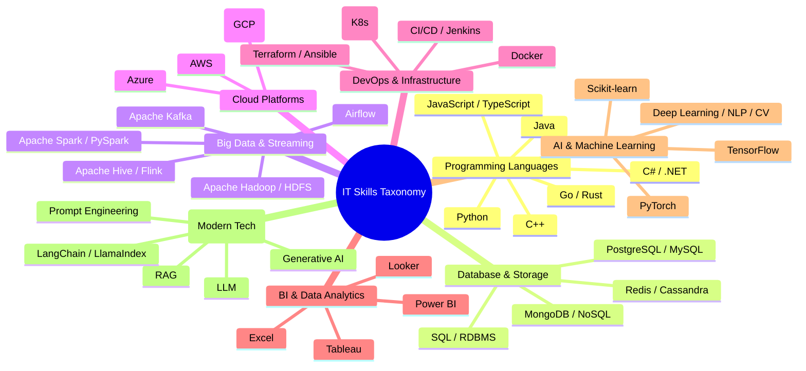

# Skill Scope & Taxonomy: Big Data IT Job Skill Analytics

Tài liệu này định nghĩa hệ thống phân loại kỹ năng (Skill Taxonomy) ban đầu cho dự án, bao gồm 8 nhóm công nghệ chính, các kỹ năng thành phần, từ khóa đồng nghĩa (synonyms / aliases) và quy tắc nhận diện.

---

## 1. Cấu trúc phân loại kỹ năng (Taxonomy Overview)

---

## 2. Chi tiết 8 nhóm kỹ năng và danh mục từ khóa

### 2.1. Programming Languages
| Mã kỹ năng | Tên kỹ năng chuẩn | Từ khóa & Biến thể nhận diện (Synonyms) |
|---|---|---|
| `prog_python` | Python | `python`, `python3`, `py` |
| `prog_java` | Java | `java`, `core java`, `java 8/11/17` |
| `prog_javascript` | JavaScript | `javascript`, `js`, `es6`, `ecmascript` |
| `prog_typescript` | TypeScript | `typescript`, `ts` |
| `prog_cpp` | C++ | `c++`, `cpp` |
| `prog_csharp` | C# | `c#`, `c sharp`, `.net c#` |
| `prog_golang` | Go | `golang`, `go language` |
| `prog_rust` | Rust | `rust`, `rustlang` |

### 2.2. Database & Storage
| Mã kỹ năng | Tên kỹ năng chuẩn | Từ khóa & Biến thể nhận diện (Synonyms) |
|---|---|---|
| `db_sql` | SQL | `sql`, `relational database`, `rdbms` |
| `db_postgresql` | PostgreSQL | `postgresql`, `postgres`, `pgsql` |
| `db_mysql` | MySQL | `mysql` |
| `db_mongodb` | MongoDB | `mongodb`, `mongo db` |
| `db_redis` | Redis | `redis`, `in-memory database` |
| `db_cassandra` | Cassandra | `cassandra`, `apache cassandra` |

### 2.3. Big Data & Distributed Processing
| Mã kỹ năng | Tên kỹ năng chuẩn | Từ khóa & Biến thể nhận diện (Synonyms) |
|---|---|---|
| `bd_spark` | Apache Spark | `spark`, `apache spark`, `pyspark`, `spark sql`, `spark streaming` |
| `bd_hadoop` | Apache Hadoop | `hadoop`, `apache hadoop`, `hdfs`, `mapreduce` |
| `bd_kafka` | Apache Kafka | `kafka`, `apache kafka` |
| `bd_hive` | Apache Hive | `hive`, `apache hive` |
| `bd_flink` | Apache Flink | `flink`, `apache flink` |
| `bd_airflow` | Apache Airflow | `airflow`, `apache airflow` |

### 2.4. Cloud Platforms
| Mã kỹ năng | Tên kỹ năng chuẩn | Từ khóa & Biến thể nhận diện (Synonyms) |
|---|---|---|
| `cloud_aws` | Amazon Web Services | `aws`, `amazon web services`, `ec2`, `s3`, `lambda`, `redshift` |
| `cloud_azure` | Microsoft Azure | `azure`, `microsoft azure`, `azure devops`, `synapse` |
| `cloud_gcp` | Google Cloud Platform | `gcp`, `google cloud`, `google cloud platform`, `bigquery` |

### 2.5. DevOps & Infrastructure
| Mã kỹ năng | Tên kỹ năng chuẩn | Từ khóa & Biến thể nhận diện (Synonyms) |
|---|---|---|
| `devops_docker` | Docker | `docker`, `containerization`, `containers` |
| `devops_k8s` | Kubernetes | `kubernetes`, `k8s` |
| `devops_cicd` | CI/CD | `ci/cd`, `cicd`, `continuous integration`, `continuous deployment` |
| `devops_jenkins` | Jenkins | `jenkins` |
| `devops_terraform` | Terraform | `terraform`, `infrastructure as code`, `iac` |
| `devops_git` | Git | `git`, `github`, `gitlab` |

### 2.6. Business Intelligence (BI) & Analytics
| Mã kỹ năng | Tên kỹ năng chuẩn | Từ khóa & Biến thể nhận diện (Synonyms) |
|---|---|---|
| `bi_powerbi` | Power BI | `power bi`, `powerbi`, `dax`, `power query` |
| `bi_tableau` | Tableau | `tableau`, `tableau desktop` |
| `bi_excel` | Microsoft Excel | `excel`, `microsoft excel`, `advanced excel`, `vba` |
| `bi_looker` | Looker | `looker`, `lookml` |

### 2.7. AI & Machine Learning
| Mã kỹ năng | Tên kỹ năng chuẩn | Từ khóa & Biến thể nhận diện (Synonyms) |
|---|---|---|
| `ml_scikit` | Scikit-learn | `scikit-learn`, `sklearn` |
| `ml_tensorflow` | TensorFlow | `tensorflow`, `tf`, `keras` |
| `ml_pytorch` | PyTorch | `pytorch`, `torch` |
| `ml_nlp` | Natural Language Processing | `nlp`, `natural language processing`, `text mining` |
| `ml_cv` | Computer Vision | `computer vision`, `opencv` |

### 2.8. Modern Generative AI & LLM
| Mã kỹ năng | Tên kỹ năng chuẩn | Từ khóa & Biến thể nhận diện (Synonyms) |
|---|---|---|
| `genai_llm` | Large Language Models | `llm`, `large language model`, `large language models` |
| `genai_general` | Generative AI | `generative ai`, `gen ai`, `genai` |
| `genai_rag` | RAG | `rag`, `retrieval augmented generation`, `retrieval-augmented generation` |
| `genai_prompt` | Prompt Engineering | `prompt engineering`, `prompt design` |
| `genai_langchain` | LangChain / Frameworks | `langchain`, `llamaindex`, `semantic kernel` |

---

## 3. Quy tắc trích xuất (Extraction Rules)
1. **Word Boundary Matching**: Sử dụng regex với `\b` để tránh false positive (ví dụ: `\bgo\b` không được khớp với `good`, `google`; `\br\b` hoặc `\bc\b` cần có ngữ cảnh chuyên biệt hoặc lọc qua cấu trúc danh sách).
2. **Case Insensitivity**: Hầu hết từ khóa được so khớp dạng chữ thường (lowercase), ngoại trừ một số từ viết tắt ngắn nhạy cảm với ngữ cảnh.
3. **Multi-word phrases first**: Ưu tiên so khớp cụm từ ghép dài trước từ đơn (ví dụ: `google cloud platform` -> `gcp`, `power bi` trước `bi`).
